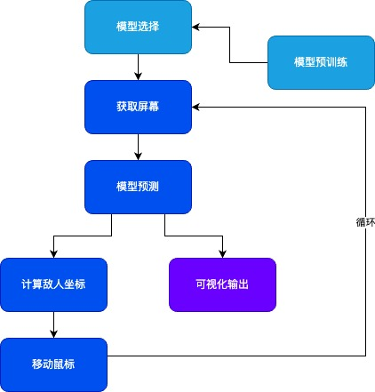
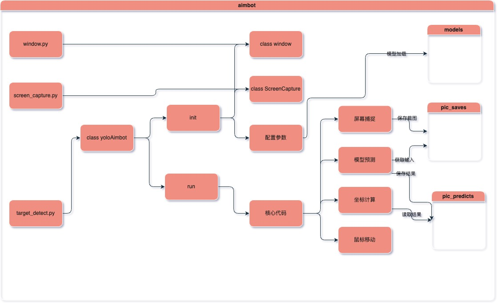
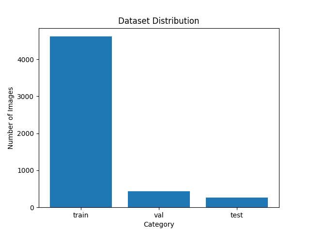
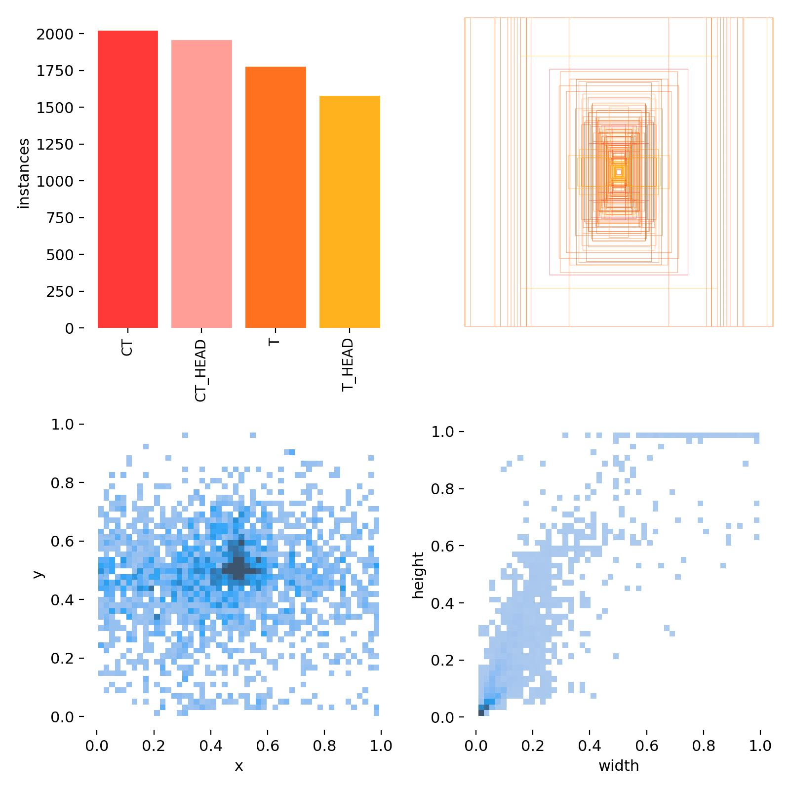
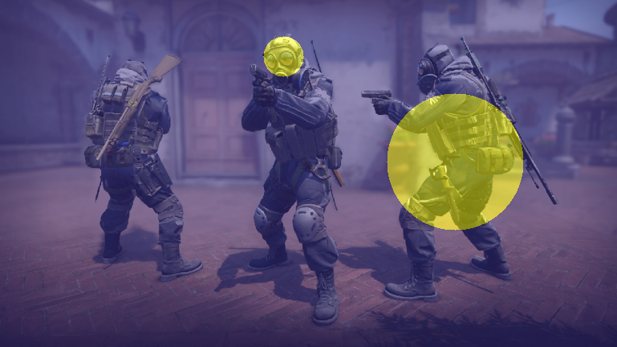
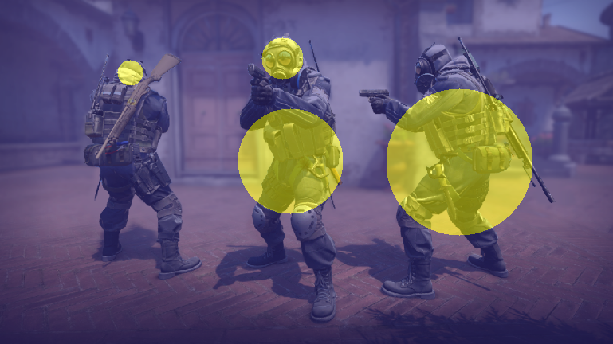
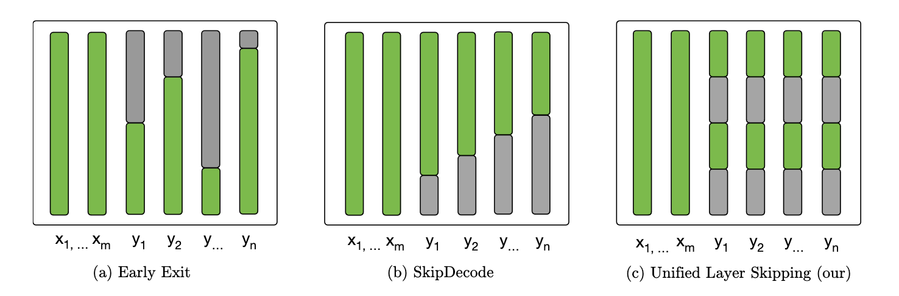
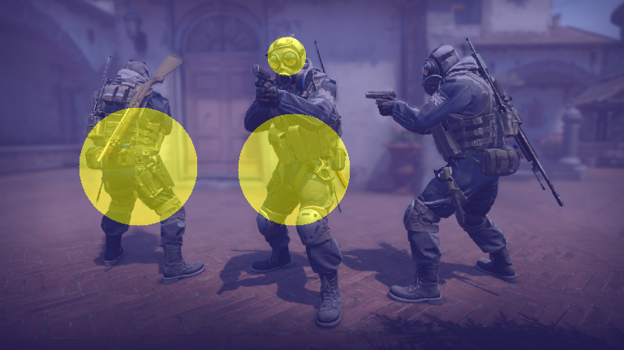
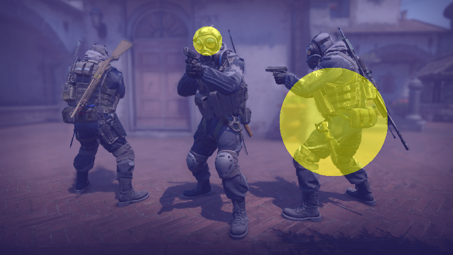

# aimbot
 
本项目使用YOLOv5以及YOLOv8模型，实现了一款CSGO游戏辅助瞄准“外挂”，并对模型各训练方式及模型效果进行了对比探究。研究内容包括模型选择、训练轮数、层冻结、跳层训练等。

---

## 一、项目结构

项目主要由图中的模块组成：
- 模型预训练
- 模型选择
- 获取屏幕
- 模型预测
- 坐标计算
- 移动鼠标
- 可视化输出

在后面的内容中分别解释主要模块的实现过程。

## 二、开发实现

### 1. 获取屏幕

使用`mss`库获取屏幕截图，格式转换为模型需要的格式后，保存到`./pic_saves`文件夹下，供模型预测模块调用。

### 2. 移动鼠标

通过`pyautogui`库实现鼠标移动，将模型预测得到的坐标作为参数传入，实现鼠标移动到目标位置。

目标位置的选择遵循以下规则：
- 检测到头部目标时优先瞄准头部
- 检测当前鼠标位置与目标位置的距离，优先瞄准距离较近的目标（欧氏距离）

### 3. 效果可视化

使用tkinter库，创建一个窗口，将屏幕模型预测结果显示在窗口中，实现实时的效果展示。

### 4. 代码结构图

## 三、效果探究

### 1. 数据集

项目使用了精确划分的CSGO游戏截图数据集，包括了玩家头部、胸部、腿部等部位的截图，用于训练模型。并依照头部和身体，反恐精英和恐怖分子的分类划分四个类别，以实现更为精确的瞄准。

1. 精准数据集

    来自[CSGO数据集](https://universe.roboflow.com/david-mikesell-vs212/cs-detect)

    数据总量5311张。划分为四类：
    - 0: 反恐精英
    - 1: 反恐精英头部
    - 2: 恐怖分子
    - 3: 恐怖分子头部

2. 数据集划分
   
    训练集：4616张（87%）
    验证集和测试集：695张（13%）

3. 数据集分布特征

 

### 2. 模型探究

#### 2.1 模型选择

首先对yolov5和yolov8的各个预训练模型在相同数据集上进行微调，比较各个模型的训练效果。

这里比较的模型有：
1. yolov5s 5-epochs 
2. yolov5s 20-epochs
3. yolov8n 5-epochs
4. yolov8n 20-epochs
5. yolov8n 30-epochs
6. yolov8s 5-epochs

可以发现，模型2的准确度最好，但推断时间达到了大约0.3秒，无法在游戏中实际使用。
模型5的准确度次之，且差距较小，但推断时间在0.1秒左右，可以更好地实际使用。
本项目最终采用的模型也是模型5。

推测其原因是yolov5s模型比yolov8n模型拥有更多的参数和更深的网络结构，因此准确度更高，但推断时间也更长。

对比同一种模型还可以发现，训练轮数越多，准确度越高，但这一提升随着轮数的增加而逐渐减小。在轮数20和30的模型之间，最大F1只提升了0.04，远远低于开始阶段的提升。这也符合深度学习模型训练的规律，即训练轮数越多，模型的提升效果越小。

但对比20轮和30轮模型的heatmap可以发现，虽然模型5的F1值提升不大，但模型检测出了更多的头部和身体，甚至还检测出了背向的头部。说明虽然没有明显表现在F1值中，模型在训练过程中学到了更多的特征。

- 模型4 heatmap:

- 模型5 heatmap:

#### 2.2 训练加速

在模型训练过程中发现，模型训练时间较长。为了改善这一问题，我尝试使用了冻结层的技术，即冻结模型开始一部分层的参数，从而加速训练过程。

这样做的原因有以下几个：
- 冻结层的参数不会被更新，可以减少计算量，加速训练
- 冻结层的参数可以保留住之前的特征提取能力，不会影响模型的准确率
- 冻结层的参数可以减少过拟合的风险

这里比较的模型有：

- yolov8n 5-epochs 10-freeze
- yolov8n 5-epochs 20-freeze
- yolov8n 20-epochs 10-freeze
- yolov8n 20-epochs 20-freeze
- yolov8s 5-epochs 20-freeze

首先，对于冻结层对模型训练速度的影响，可以发现冻结层的出现使得模型训练速度大幅提升，从原本的27min/epoch提升到了17min/epoch，训练时间降为了原本的0.63。但随着冻结层数的增加，训练速度的提升效果变小，当冻结层从10增加到20时，每epoch训练时长只减少了2min。

其次，对于冻结层对模型准确率的影响，可以发现当训练轮数较少，为5，冻结层较少，为10时，冻结层的出现使模型的最大F1值反而提升了0.04-0.09不等。这可能是因为模型保留了更好的泛用性，提高了性能。

但当轮数提高到20轮的模型时，冻结层的出现使得F1值下降了0.01，基本与原模型持平。这可能是因为模型在训练过程中学到了更多的特征，冻结层的出现使得模型无法更新这些特征，导致了性能的下降。同时模型冻结参数获得的泛用性具有的优势也逐渐减少。

#### 2.3 跳层训练

在使用冻结层技术加速训练的基础上，我尝试了跳层冻结训练的技术，即每次跳过一个层进行冻结。

这样的想法来源于Layer Skipping Strategy技术 [Accelerating Inference in Large Language Models with a
Unified Layer Skipping Strategy](https://arxiv.org/pdf/2404.06954)

如上图，该技术运用于大语言模型领域，使用了整体层跳过的技术，在减少模型内存占用、加速计算的同时，达到了比其他技术如Early Exit、SkipDecode更高的性能。
出于这一想法，我做出了以下探究，比较了跳层冻结训练和普通冻结训练的效果以及他们的训练速度。

测试模型：
- yolov8n 5epochs 10-jump-freeze
- yolov8n 5epochs 20-jump-freeze
- yolov8m 5epochs 20-jump-freeze

实验发现，当冻结层较少时，采用跳层冻结策略的模型准确度与普通冻结策略的模型准确度相当；但当冻结层数增大时，跳层冻结策略的模型准确度明显高于普通冻结策略的模型准确度，并且超过了无冻结层模型的准确度。这可能是因为相比普通冻结策略，跳层冻结策略使得模型保留了更多的特征提取能力，使模型的参数有更多的机会被改变，提高了模型的性能。

从heatmap也可以看出，跳层冻结策略的模型识别能力甚至强于冻结了更少层的普通冻结模型。

- 模型 yolov8n 5epochs 20-jump-freeze

- 模型 yolov8n 5epochs 10freeze

但同时，跳层冻结策略的训练速度虽然相较无冻结模型有明显提升，却也明显低于普通冻结策略的训练速度，这可能是因为跳层冻结策略使得模型的参数更新更为复杂，增加了训练的难度。

## 四、总结

本项目实现了一款CSGO游戏辅助瞄准“外挂”，并对模型各训练方式及模型效果进行了对比探究。研究内容包括模型选择、训练轮数、层冻结、跳层训练等。

未来还可以进一步探究的方向有：
1. 更多模型的对比，如yolov4、yolov10等
2. 在跳层冻结的基础上，尝试更多的冻结策略，如冻结层的间隔、冻结层的数量等。
3. 尝试不仅冻结一部分层，还跳过一部分层的计算，从而提高模型的推断速度。

---

#### 备注：

models对应训练文件(val_result也有保存)

- yolov8n 5epochs no-freeze train6
- yolov8n 20epochs no-freeze train7
- yolov8n 5epochs 20-freeze train17
- yolov8n 5epochs 10-freeze train19
- yolov8s 5epochs 20-freeze train20
- yolov8n 20epochs 20-freeze train21
- yolov8n 20epochs 10-freeze train22
- yolov8n 5epochs 10-jump-freeze train23
- yolov8n 5epochs 20-jump-freeze train24
- yolov8n 30epochs no-freeze train28
- yolov8s 5epochs no-freeze train29
- yolov8m 5epochs 20-jump-freeze train36
- yolov5s 20epochs no-freeze exp7
- yolov5s 5epochs no-freeze exp6

训练结果表：

[aimbot结果表](aimbot_table.xlsx)